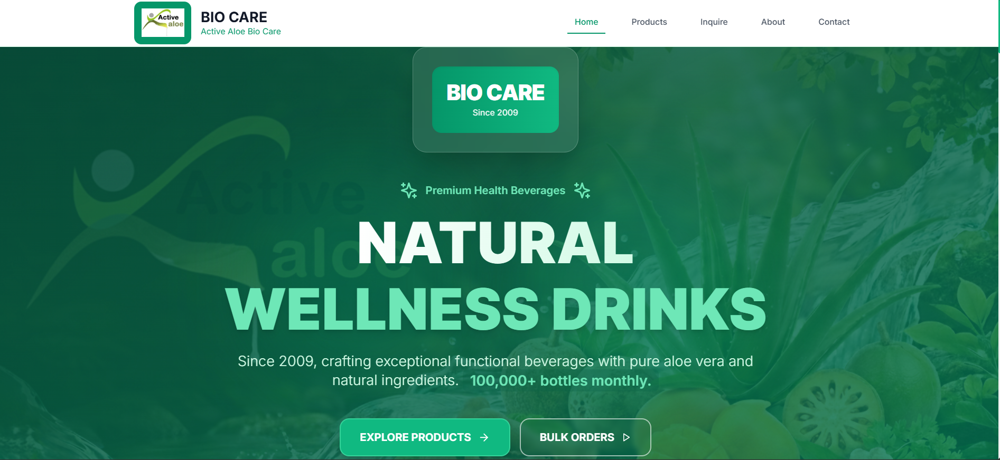
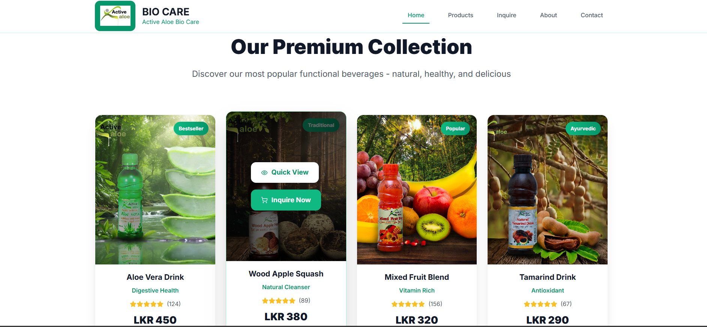
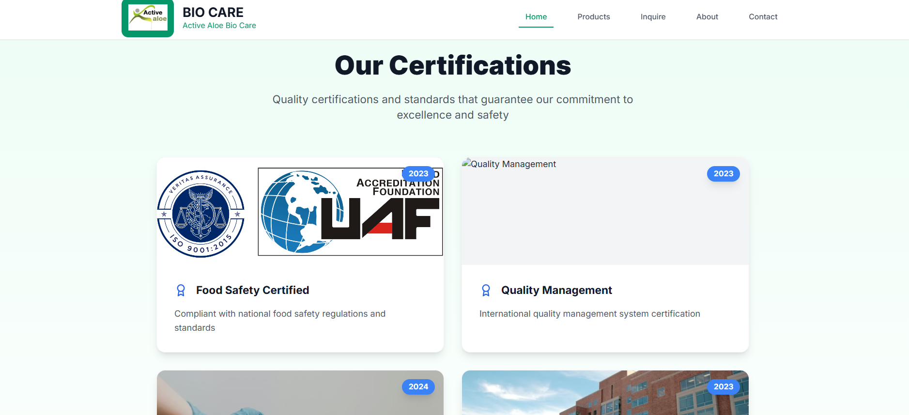
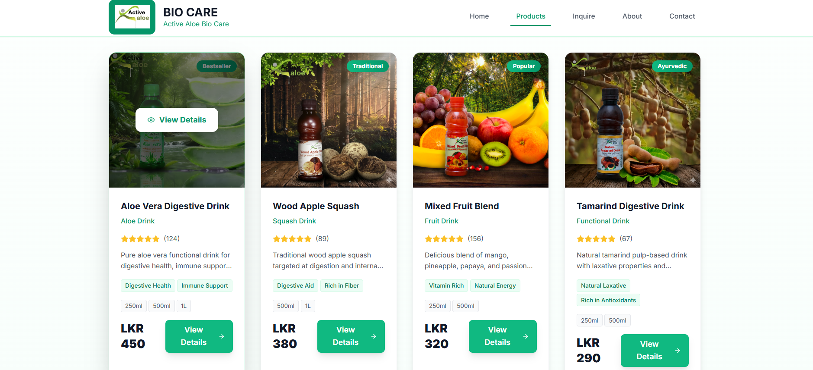
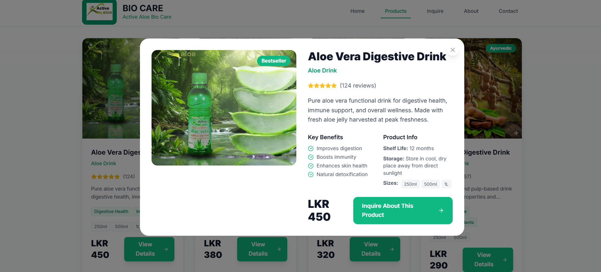
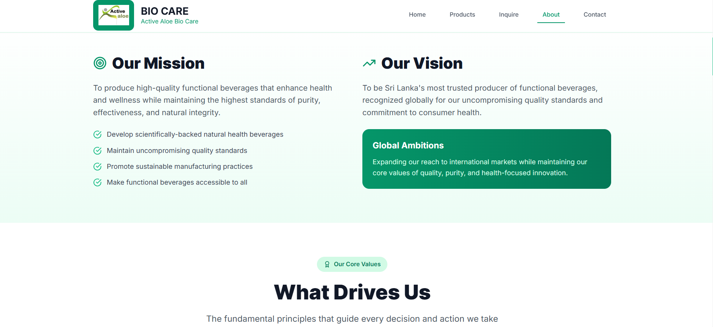
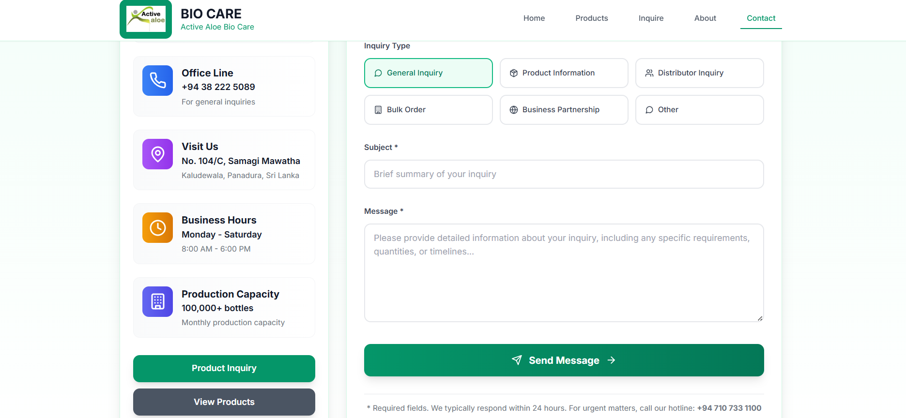
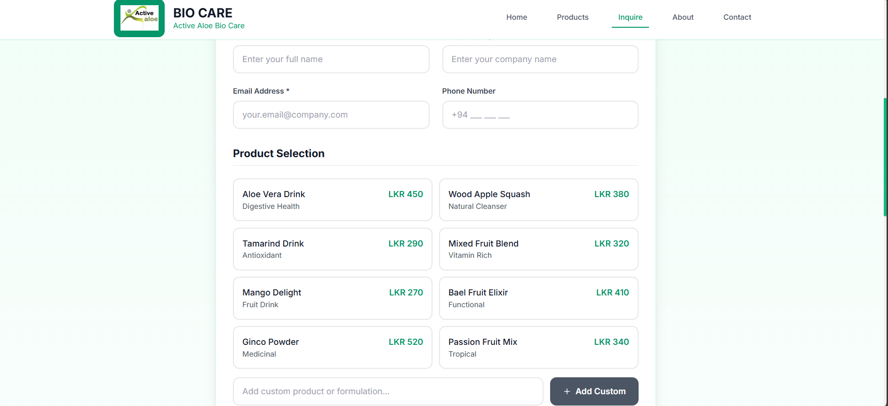

# Bio Care — Company Website

Pioneering functional beverage production in Sri Lanka — company website and product inquiry portal.

## Project Overview
This repository contains the client-side source for the Bio Care company website (biocare-web). It's a React single-page application (SPA) built with Vite and styled with Tailwind CSS. The site provides company information, product listings, contact and inquiry forms for business customers and distributors.

Primary client-visible pages :
- Home — src/pages/Home.jsx
- About — src/pages/About.jsx
- Products — src/pages/Products.jsx
- Inquire (bulk / business inquiries) — src/pages/Inquire.jsx
- Contact (contact form and message summary) — src/pages/Contact.jsx

## Problem Statement
Bio Care needs a public-facing web presence that:
- Presents company information and milestones (since 2009).
- Shows product information and quality claims.
- Collects product inquiries and business / bulk order requests.
- Provides contact details and a contact form for customers and partners.

## Solution & Key Features
Implemented in this repository:
- React SPA built with Vite (fast dev + build).
- Tailwind-based UI with reusable components 
- Pages for marketing content, product listings, testimonials and company milestones.
- Inquiry and contact forms collecting:
  - Contact fields: name, email, phone, company, subject, message.
  - Inquiry-specific fields (Inquire.jsx): products, businessType, deliveryTimeline, targetMarket, etc.

## System Architecture

What the contains :

- Frontend: React 18 SPA (JSX) — source under src/
- Build tool: Vite — vite.config.js is present and the app is served via Vite in development
- Entry: index.html loads /src/main.jsx
- No server-side / API or backend code is included in this repository (the codebase is client-only)

## Technology Stack
Taken directly from package.json and project files:
- Framework / libraries:
  - react ^18.2.0
  - react-dom ^18.2.0
  - react-router-dom ^6.30.2
  - lucide-react ^0.263.1 (icons)
- Build / dev tooling:
  - vite ^4.4.5
  - @vitejs/plugin-react ^4.0.3
  - tailwindcss ^3.4.18
  - postcss, autoprefixer
  - eslint (eslint.config.js present)

## AI / Intelligent Features (Optional)
No AI or machine-learning features, models, or AI SDKs are present in the project.

## Installation & Setup

1. Clone repository
   git clone https://github.com/kspeiris/biocare-web.git
   cd biocare-web

2. Install dependencies
   npm install

3. Run development server (Vite)
   npm run dev
   - The project is configured to run Vite on port 3000 via the `dev` script.

4. Build for production
   npm run build

5. Preview production build
   npm run preview

Scripts (from package.json):
- dev: "vite --port 3000"
- build: "vite build"
- preview: "vite preview"

## Configuration
- Entry point: index.html -> src/main.jsx

## Screenshots

### Home Page

### Products Section

### Other Pages

## Demo 

- Link : https://bio-care-web.netlify.app

## Future Enhancements
The repository itself does not include an explicit roadmap or TODO list. Suggested next steps (not present in repo — developer decisions):
- Add CI (GitHub Actions) to run lint/build on push.
- Add tests and coverage.
- Add a deployment pipeline for hosting built assets.
- Integrate backend endpoints or webhook handlers if contact/inquiry forms should persist data.

## Learning Outcomes

- Building a marketing/company site using React + Vite and Tailwind.
- Composition of multiple page components and a simple SPA router (react-router-dom).

## Author
Repository owner: [kspeiris](https://github.com/kspeiris) — repository: https://github.com/kspeiris/biocare-web

